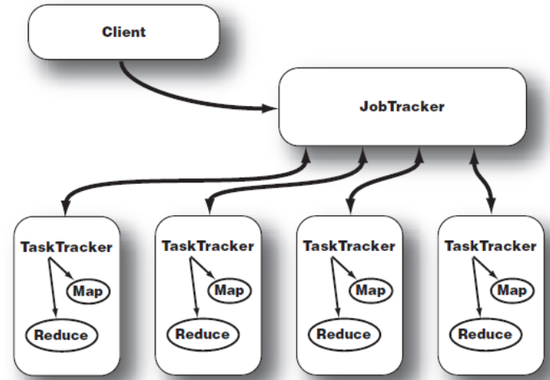

# 04: 맵리듀스 시작하기

[05: 맵리듀스 기초 다지기](https://www.notion.so/05-380bb40ff5644055bf4eefb939c2ca8e?pvs=21)

맵리듀스 기능을 사용하면 대량의 데이터를 병렬 처리할 수 있습니다.

## 4.1 맵리듀스 개념

Map-Reduce는 Map과 Reduce라는 두개의 메서드로 구성됩니다. 이때 Map은 키와 값으로 구성된 데이터를 받아 이를 가공하고 분류하여 새로운 키와 값으로 구성된 목록을 출력합니다. Map 작업을 여러번 하다 보면 같은 키를 갖게 되는 데이터가 생길 수 있습니다. Reduce 메서드는 새로운 키들에 대해 데이터를 모으고, 같은 키 값을 갖고 있는 데이터들에 대해 집계 연산을 하여 몇개나 되는지 셉니다.

간단한 예를 들어 다음과 같은 데이터를 받았을 때, 키와 값은 각각 #1과 read a book가 됩니다.

> #1 read a book
#2 write a book
> 

이때 맵 메소드를 사용하면 다음과 같이 키가 read 값이 1이 되고, 병합까지 완수하면 다음처럼 바뀝니다.

// 정렬

> <read, 1>
<a, 1>
<book, 1>
<write, 1>
<a, 1>
<book, 1>
> 

// 병합

> <read, (1)>
<a, (1,1)>
<book, (1,1)>
<write, (1)>
> 

마지막으로 리듀스 메소드를 사용하면 새로운 키인 글자별로 각 글자수를 합산해서 출력합니다.

> <read, 1>
<a, 2>
<book, 2>
<write, 1>
> 

## 4.2 맵리듀스 아키텍처

아키텍처를 모른다면 성능을 고려하지 못하기 때문에 결국에는 서비스를 사용할 수 없게 됩니다.

### 4.2.1 시스템 구성

맵리듀스 시스템은 클라이언트, 잡트래커, 태스크트래커로 구성됩니다.

************Client************

Client란 사용자가 실행한 맵리듀스 프로그램과 하둡에서 제공하는 맵리듀스 API를 뜻합니다.

**********************Job Tracker**********************

Client가 하둡으로 실행을 요청하는 맵리듀스 프로그램은 잡(job) 이라는 단위로 관리됩니다. 이때, job tracker는 하둡 클러스터에 등록된 전체 job의 스케줄링을 관리하고 모니터링합니다.

사용자가 새로운 job을 요청하면 jobtracker가 해당 job를 처리하기 위해 몇 개의 맵과 리듀스가 필요한지 결정하고 task tracker에게 job을 할당합니다. 

Job tracker와 Task tracker는 서로 heartbeat이라는 메소드로 네트워크 통신을 하면서 tasktracker의 상태와 실행 정보를 주고 받습니다.

************************Task Tracker************************

Task Tracker는 Job Tracker으로 부여받은 맵리듀스 프로그램을 실행합니다. 맵 테스크와 리듀스 테스크를 하기 위해서는 TaskTracker는 재사용할 수 없는 JVM을 구동하여 테스크를 실행합니다.

### 4.2.2 맵리듀스 작동 방식

맵리듀스의 세부 작동 방식은 다음과 같습니다.

1. 사용자는 job에 대한 실행 정보를 설정하고 실행합니다.
2. 새로운 job client 객체가 생성되고 이 객체가 job tracker에게 job을 실행해달라고 요청합니다.
3. job client는 job의 입렫에 대한 입력 스플릿 (input split)을 계산합니다.
4. job client의 메시지를 받은 job tracker는 큐에 등록하고 job scheduler가 큐를 가져와서 초기화합니다. 초기화 후 입력 스플릿의 개수만큼 맵 테스크를 생성합니다. job tracker는 heartbeat 메소드를 통해 전달된 정보를 이용해 task tracker에게 task 실행을 요청합니다.
5. task tracker는 job tracker가 할당해준 map task를 실행합니다.
6. map task는 출력이 완료되면 자신을 실행한 task tracker에게 작업이 정상적으로 끝났다는 메시지를 보내줍니다. reduce task는 주기적으로 task tracker에게 map task의 출력 데이터 경로를 물어보고 로커 노드로 복사합니다.
7. reduce task는 모든 map task의 출력 데이터를 복사한 후 병합합니다.
8. reduce task는 출력 데이터를 HDFS에 part-nnnnnn이라고 저장하며, nnnnnn는 파티션 ID이고 000000부터 1씩 증가합니다.

> input split이란?
하나의 맵에서 처리해야 하는 입력 파일의 크기이며, HDFS의 기본 블록 사이즈인 64MB보다 큰 경우에만 입력 스플릿이 생성된다.
> 

### 4.2.3 하둡 프로그래밍 요소

**데이터 타입**

맵리듀스 프로그램에서 키와 값으로 사용되는 모든 데이터 타입은 반드시 WritableComparable 인터페이스가 구현되어 있어야 하며, 해당 인터페이스는 데이터값을 직렬화하고 직렬화된 데이터값을 해제해서 읽는 역할을 구현하고 있다. 

****InputFormat****

맵리듀스는 입력 스플릿을 맵 메서드의 입력 파라미터로 사용할 수 있게 InputFormat이라는 추상화 클래스를 제공합니다. 

**********************매퍼 (Mapper)**********************

매퍼는 맵 메서드의 기능을 수행합니다. 키와 값으로 구성된 입력 데이터를 전달받아 이 데이터를 가공하고 분류해서 새로운 데이터 목록을 생성합니다.

**파티셔너 (Partitioner)**

파티셔너는 맵 테스크의 출력 데이터가 어떤 리듀스 태스크로 전달될지 결정합니다.

**리듀서 (Reducer)**

리듀서 클래스에서는 맵 태스크의 출력 데이터를 입력 데이터로 전달받아 집계 연산을 수행합니다.

**콤바이너 (Combiner)**

맵 태스크의 출력 데이터는 네트워크를 통해 리듀스 태스크로 전달되며, 이러한 맵 태스크와 리듀스 태스크 사이의 데이터 전달 과정을 **셔플 (shuffle)** 이라 부릅니다. Combiner 클래스는 셔플할 데이터의 크기를 줄이는 데 도움을 줍니다.

**OutputFormat**

맵 리듀스 job의 출력 데이터 포맷은 job interface의 setOutputFormatClass 메서드로 설정한 포맷대로 만들어집니다. 이때 사용되는 출력 데이터 포맷은 OutputFormat이라는 추상화 클래스를 상속받아 구현됩니다. 

## 4.3 WordCount 만들기

1. 매퍼 구현: 매퍼 클래스를 구현합니다. 키가 라인 번호이고, 값이 문장인 입력 파라미터를 받아 키가 글자이고 값이 글자수인 목록을 출력합니다.
2. 리듀서 구현: 글자와 글자수를 받아 글자 수를 합산해서 출력하는 리듀서 클래스를 구현합니다.
3. 드라이버 클래스 구현: 매퍼와 리듀서 클래스를 실행하는데 도움을 줍니다. job에 대한 실행 정보를 설정하고, 맵리듀스 잡을 실행합니다.

이후 빌드 및 실행을 하여 웹에서 실행 결과를 확인합니다.